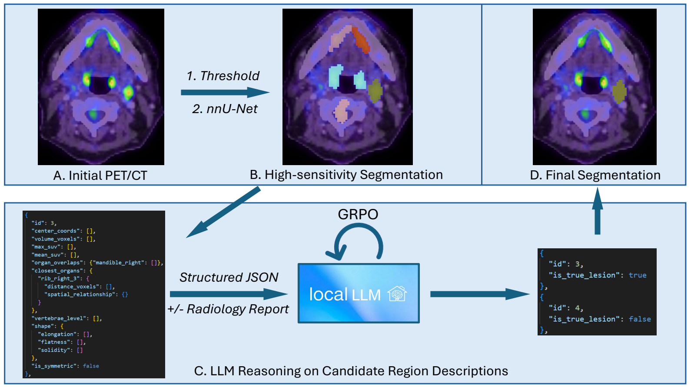

# RADIANT-PET

Reasoning-Augmented Description-Inference Network for PET/CT (RADIANT-PET) combines permissive PET/CT candidate segmentation with lesion-level large-language-model reasoning. Candidate regions are converted to structured descriptions of uptake, morphology, and anatomical context; an LLM then removes likely physiological uptake while retaining lymphoma.

This repository accompanies **"RADIANT-PET: Reasoning-Augmented PET/CT Lesion Segmentation with Large Language Models and Reinforcement Learning," accepted at MICCAI 2026.**

[](data/fig1.pdf)

*Figure 1. RADIANT-PET generates permissive PET/CT candidates, converts them into structured anatomical descriptions, and uses LLM reasoning to remove physiological false positives. Click the figure for the PDF version.*

## Method

The pipeline has four stages:

1. **Candidate generation** - either SUV thresholding (SUV 3.5 seeds grown into adjacent SUV 2.5 voxels) or HS-UNet inference at a permissive 0.1 decision threshold.
2. **Candidate separation** - distance-transform watershed followed by SUV-valley validation separates confluent uptake.
3. **Structured description** - each candidate receives PET intensity, volume, 3D shape, TotalSegmentator overlap/proximity, vertebral level, and body-centered location features.
4. **LLM adjudication** - gpt-oss-20b or another LLM labels each candidate as `lesion_site` or `physiological_site`. The released training code uses Group Relative Policy Optimization (GRPO) with a binary-class reward plus an anatomical-site reward.

## Repository layout

```text
preprocess.py                         unified preprocessing CLI
suv_threshold_processing/            threshold candidate implementation
nnunet_processing/                    HS-UNet mask post-processing and descriptions
utils/                                shared mask, geometry, and dataset utilities
GRPO/
  training/                           GRPO training entry points
eval/                                 consolidated LLM inference and evaluation
  evaluation_results/autopet/         released AutoPET per-case metric CSVs
  evaluation_results/osu/             released institutional per-case metric CSVs
data/
  lymphoma_site_lists.json            allowed anatomical labels
  totalsegmentator_index_mapping.json TotalSegmentator label map
  autopet_nnunet/train/                public HS-UNet candidate training set
  autopet_threshold/train/             public SUV-threshold candidate training set
```

Patient images, reports, model checkpoints, adapters, and generated predictions are intentionally excluded.

## Model weights

The segmentation model and lesion-reasoning adapters are archived separately on Zenodo:

| Artifact | Candidate source | Zenodo record |
|---|---|---|
| HS-UNet segmentation checkpoints | PET/CT images | [20775753](https://zenodo.org/records/20775753) |
| AutoPET LoRA adapter | HS-UNet candidates | [20785543](https://zenodo.org/records/20785543) |
| AutoPET LoRA adapter | SUV-threshold candidates | [20785543](https://zenodo.org/records/20785543) |

Download and extract the required artifact outside the Git repository. Pass the HS-UNet checkpoint folder through `--model-dir` and the selected LoRA adapter folder through `--model_path`.

Only the report-free AutoPET LoRA adapters are publicly released. The report-conditioned LoRA adapter is not open sourced because it was trained using institutional patient data and reports.

## Installation

Python 3.10 or 3.11 is recommended. Create a clean environment from the repository root:

```bash
python -m venv .venv
source .venv/bin/activate
python -m pip install -r requirements.txt
```

Choose one of these nnU-Net installations.

**Option 1 — official AutoPET 3 implementation (recommended).** This provides the original `autoPET3_Trainer` and dual-head network used by the released checkpoints:

```bash
git clone https://github.com/MIC-DKFZ/autopet-3-submission.git nnunet/autopet_3_submission
python -m pip uninstall -y nnunetv2
python -m pip install -e nnunet/autopet_3_submission
python -c "import nnunetv2; print(nnunetv2.__file__)"
```

Source: [MIC-DKFZ AutoPET 3 submission](https://github.com/MIC-DKFZ/autopet-3-submission).

**Option 2 — standard nnU-Net from PyPI.** The inference script automatically supplies a compatibility alias for the checkpoint's trainer name and ignores its training-only auxiliary organ-head parameters:

```bash
python -m pip install "nnunetv2>=2.5"
python -c "import nnunetv2; print(nnunetv2.__file__)"
```

> **Important:** TotalSegmentator requires PyTorch `<2.6`. Install and run it in a separate environment.

```bash
conda create -n radiant-totalseg python=3.11 -y
conda activate radiant-totalseg
python -m pip install -r requirements-preprocessing.txt
TotalSegmentator --help
```

Run any `preprocess.py` command that includes `--run-totalsegmentator` in this `radiant-totalseg` environment. Commands that use existing masks through `--organ-mask-dir` do not invoke TotalSegmentator and may run in the main environment.

For LLM inference and GRPO training, use a separate CUDA-capable environment:

```bash
conda create -n radiant-llm python=3.11 -y
conda activate radiant-llm
python -m pip install -r requirements-llm.txt
```

Unsloth and PyTorch installation depends on the available CUDA version; follow the platform-specific Unsloth instructions when needed.

## Input convention

Each case uses nnUNet modality naming:

```text
inputs/
  CASE001_0000.nii.gz   # CT
  CASE001_0001.nii.gz   # PET in SUV units, registered to CT
organ_masks/
  CASE001_0000_total.nii.gz
  CASE001_0000_head_glands.nii.gz
  CASE001_0000_hn_vessels.nii.gz
  CASE001_0000_hn_muscle.nii.gz
```

The organ masks are multi-label TotalSegmentator outputs. With `--run-totalsegmentator`, no mask directory needs to exist in advance: missing masks are generated under `<output-dir>/organ_masks` by default. Use `--organ-mask-dir` only to choose a different destination or to supply precomputed masks. PET and CT geometry must correspond. The code resamples label masks with nearest-neighbor interpolation when affines differ.

## Unified preprocessing

Threshold candidates:

```bash
python preprocess.py \
  --input-dir /path/to/inputs \
  --output-dir /path/to/descriptions \
  --source threshold \
  --run-totalsegmentator
```

This creates `/path/to/descriptions/organ_masks` automatically. To place generated masks elsewhere, add `--organ-mask-dir /another/path`. If TotalSegmentator masks already exist, omit `--run-totalsegmentator` and provide their directory explicitly:

```bash
python preprocess.py \
  --input-dir /path/to/inputs \
  --organ-mask-dir /path/to/existing_organ_masks \
  --output-dir /path/to/descriptions \
  --source threshold
```

HS-UNet candidates require the external trained-model folder. First run inference:

```bash
python nnunet_processing/infer_hs_unet.py \
  --input-dir /path/to/inputs \
  --model-dir /path/to/hs_unet_model \
  --output-dir /path/to/hs_unet_predictions \
  --trust-checkpoints
```

Then create watershed-separated descriptions with precomputed TotalSegmentator masks:

```bash
python preprocess.py \
  --input-dir /path/to/inputs \
  --organ-mask-dir /path/to/organ_masks \
  --candidate-mask-dir /path/to/hs_unet_predictions \
  --output-dir /path/to/descriptions \
  --source hs-unet
```

To generate the anatomical masks automatically, omit `--organ-mask-dir` and add `--run-totalsegmentator`:

```bash
python preprocess.py \
  --input-dir /path/to/inputs \
  --candidate-mask-dir /path/to/hs_unet_predictions \
  --output-dir /path/to/descriptions \
  --source hs-unet \
  --run-totalsegmentator
```

Each case produces:

```text
CASE001_candidates.nii.gz
CASE001_description.json
```

Use `python preprocess.py --help` for case selection, dry-run, overwrite, and threshold options. The manuscript defaults are already selected: seed SUV 3.5, growth SUV 2.5, 18-connectivity, and a 20-voxel minimum candidate size.

## LLM inference

Two AutoPET LoRA adapters are released. The adapter must match the method used to generate the candidate descriptions:

- use the **HS-UNet-trained adapter** for descriptions produced with `--source hs-unet`;
- use the **SUV-threshold-trained adapter** for descriptions produced with `--source threshold`.

HS-UNet candidate inference:

```bash
python eval/infer_gpt_oss.py \
  --data_dir /path/to/hs_unet_descriptions \
  --model_path /path/to/hs_unet_trained_lora_adapter
```

SUV-threshold candidate inference:

```bash
python eval/infer_gpt_oss.py \
  --data_dir /path/to/threshold_descriptions \
  --model_path /path/to/threshold_trained_lora_adapter
```

Add `--use_report` only when each JSON file contains the corresponding de-identified report under `metadata.pet_report`. MedGemma uses the same interface:

```bash
python eval/infer_medgemma.py --data_dir /path/to/descriptions
```

API baselines read credentials from the environment:

```bash
export GEMINI_API_KEY=...
python eval/infer_api_models.py \
  --data_dir /path/to/descriptions \
  --model_type gemini \
  --model_name YOUR_MODEL
```

For OpenAI, select `--model_type openai` and set `OAI_API_KEY`.

## GRPO training

`GRPO/training/train_grpo_no_reports.py` trains the report-free AutoPET models with batch size 4. Two public AutoPET-derived Hugging Face datasets are included:

- `data/autopet_nnunet/train`: 2,066 candidates generated by HS-UNet.
- `data/autopet_threshold/train`: 5,855 candidates generated by SUV thresholding.

Both datasets contain `input_text`, `output_text`, and `original_output` fields and do not contain institutional reports. Train either candidate pathway from the repository root:

```bash
python GRPO/training/train_grpo_no_reports.py --candidate-source hs-unet
python GRPO/training/train_grpo_no_reports.py --candidate-source threshold
```

Use `--data-dir` to override the bundled dataset and `--output-dir` to choose the adapter destination.

`GRPO/training/train_grpo_with_reports.py` trains the report-conditioned institutional model with batch size 2. Its private dataset is not distributed and must be supplied explicitly:

```bash
python GRPO/training/train_grpo_with_reports.py \
  --data-dir /path/to/private_report_dataset
```

Both training paths use gradient accumulation 4, LoRA rank 8, and 1,200 micro-steps as reported in the paper.

Custom training data may be a Hugging Face `Dataset` or `DatasetDict` containing:

```text
input_text   structured candidate description, optionally including report text
output_text  physiological_site: SITE or lesion_site: SITE
```

The reward gives 1 point for the correct binary class and 2 additional points for the exact anatomical site. Local datasets and resulting adapters are ignored by Git.

## Evaluation

Evaluate candidate classification and the final filtered segmentations:

```bash
python eval/evaluate_predictions.py \
  --json_dir /path/to/prediction_json \
  --seg_dir /path/to/candidate_masks \
  --gt_dir /path/to/ground_truth \
  --output_dir /path/to/metrics \
  --filtered_seg_dir /path/to/filtered_masks
```

For image-only candidate masks:

```bash
python eval/evaluate_segmentation_masks.py \
  --pred_dir /path/to/predictions \
  --gt_dir /path/to/ground_truth \
  --output_dir /path/to/metrics
```

The per-case classification and segmentation metrics reported in the manuscript are included under `eval/evaluation_results/`, separated into `autopet/` and `osu/`. These CSVs contain numeric evaluation results and study case identifiers only; images, reports, prediction masks, and other raw institutional data are not distributed. See `eval/evaluation_results/README.md` for details.

## Citation

```bibtex
@inproceedings{wang2026radiantpet,
  title  = {RADIANT-PET: Reasoning-Augmented PET/CT Lesion Segmentation with Large Language Models and Reinforcement Learning},
  author = {Wang, Jiasheng and Jitwatcharakomol, Tanun and Jongpradubgiat, Piyawadee and Zhu, Simeng},
  booktitle = {Medical Image Computing and Computer Assisted Intervention -- MICCAI 2026},
  year   = {2026}
}
```
